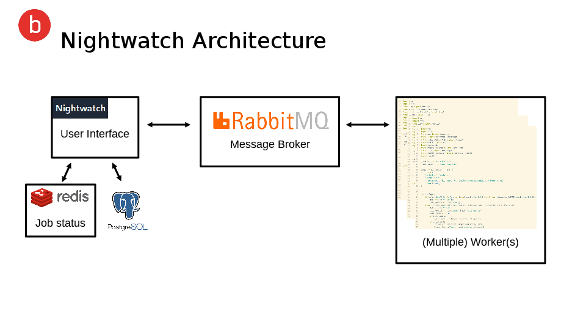
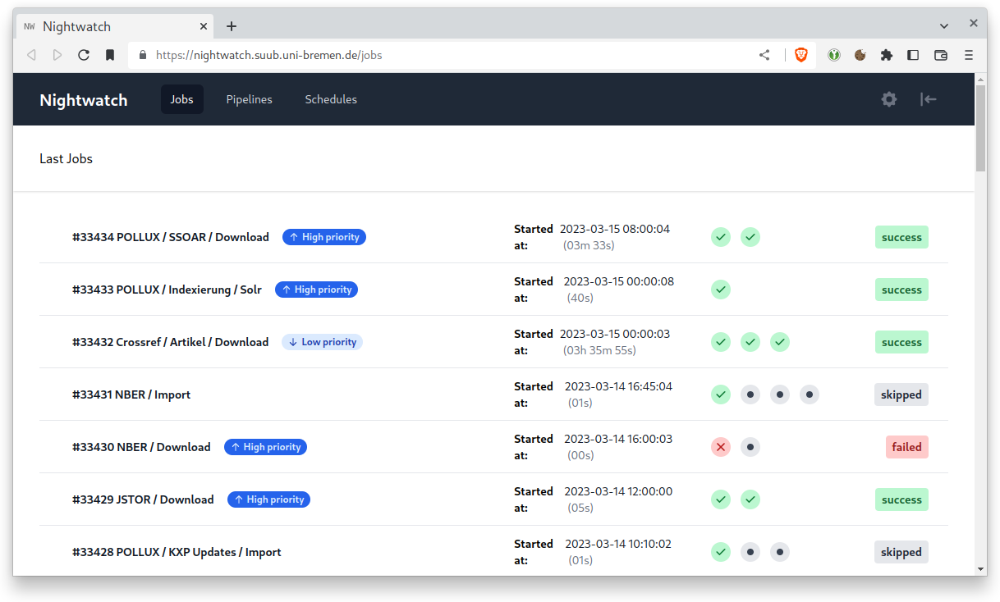

# Nightwatch Deployment




## Prerequisites

* docker (e.g. https://docs.docker.com/desktop/)
* docker compose (included in docker desktop or https://docs.docker.com/compose/install/)


## Getting Started

Clone this repository including the submodule `metadata-worker` that contains the actual scripts to process metadata

```
git clone https://gitlab.suub.uni-bremen.de/public-projects/nightwatch-deployment.git --recursive
```

To start nightwatch and all its components run

```
docker compose up -d
```

The nightwatch UI will be available at `localhost:4000` after a few seconds.




## Usage

See the [wiki](https://gitlab.suub.uni-bremen.de/public-projects/nightwatch-deployment/-/wikis/Getting-Startet)

## Support

If you find a bug or have ideas for features and improvement, please don't hesitate to create an issue.

[Contact us](mailto:nightwatch@suub.uni-bremen.de)
